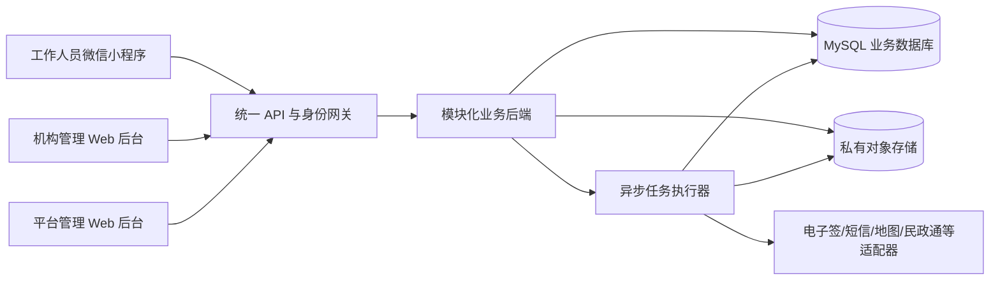
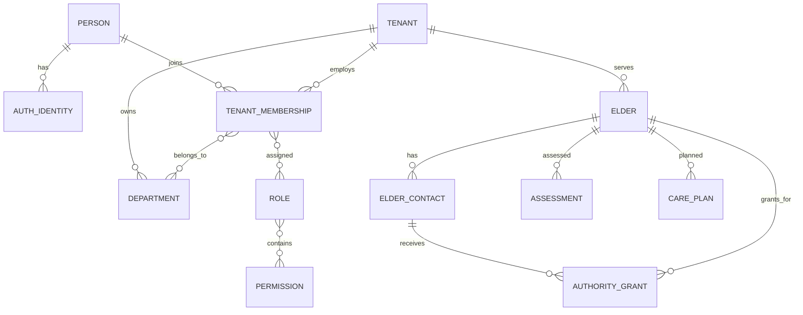
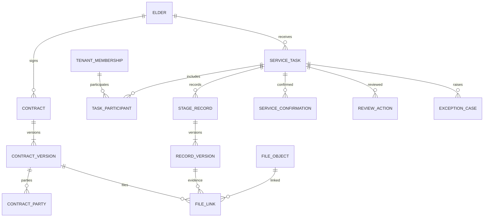
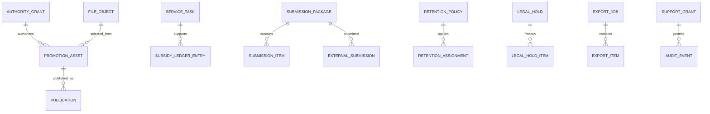

# 医养照护 SaaS 第一版技术设计

> 文档状态：技术设计草案，待项目发起人确认
> 版本：0.3
> 日期：2026-08-08
> 对应需求：`requirements.md`、`scope-v1.md`

## 1. 设计目标

本设计服务于首家兰州机构的受控试点，同时保证第二家机构接入时不需要复制代码或重建后端。

第一版优先保证：

1. 多租户数据不能串租户。
2. 老人、合同、服务、原始影像、审核和宣传授权可形成完整证据链。
3. 一线人员通过微信小程序完成前中后记录，管理人员通过电脑 Web 后台处理审核、档案和宣传素材。
4. 图片、视频不经过业务服务器中转，避免服务器带宽和磁盘成为瓶颈。
5. 业务规则和表单可以版本化配置，但法定授权、审计、原件保护和租户隔离不能被机构关闭。
6. 第一版由少量开发和运营人员能够维护，不引入不必要的微服务、多云和大规模基础设施。

## 2. 总体架构决策

### 2.1 采用模块化单体

第一版后端采用一个模块化单体应用。员工、老人、合同、服务、影像、宣传、补贴、审计等模块在代码和数据库边界上分离，但作为一个后端服务部署。

选择原因：

- 单门店试点不需要微服务的独立扩缩容和团队边界。
- 合同、服务、影像和审核存在大量强事务关联，单体更容易保证一致性。
- 统一权限、租户上下文和审计入口更安全。
- 后续只有当某个模块出现独立容量或团队需求时再拆分，例如媒体处理、批量导出或监管接口。

### 2.2 参考部署选择腾讯云 CloudBase

第一版参考部署采用腾讯云 CloudBase，但业务代码通过适配接口隔离云厂商能力。

参考能力组合：

- CloudBase Run：运行统一后端和异步任务执行器。
- CloudBase MySQL：保存结构化业务数据。
- CloudBase 云存储/COS：保存合同、照片、视频和导出包。
- CloudBase Auth：Web 后台身份认证。
- 微信小程序原生身份：识别小程序调用者。
- 静态网站托管：部署机构管理后台和平台管理后台。
- 日志、监控和告警：记录运行状态。

CloudBase 当前提供小程序、Web、云托管、MySQL、身份认证和云存储的一体化能力，适合首家试点的低运维需求：[CloudBase 产品概述](https://cloud.tencent.com/document/product/876/18431)。

最终购买云资源前仍需确认账号主体、地域、套餐和备案条件。设计不依赖只有腾讯云才能提供的业务接口。

### 2.3 客户端不直连业务数据库

虽然云平台支持客户端 SDK 访问数据库，但本系统涉及租户隔离、敏感个人信息、跨表事务和复杂权限，微信小程序及 Web 后台均不得直接读写 MySQL。

所有业务操作必须经过统一后端：

- 验证调用者身份；
- 解析当前租户和机构任职关系；
- 校验部门、角色、权限和对象范围；
- 执行业务状态机；
- 写入业务数据和审计记录；
- 返回经过脱敏的数据。

### 2.4 为什么选择 TypeScript 模块化单体和 MySQL

这不是“唯一正确”的技术组合，而是当前人员、期限和业务复杂度下风险最低的组合。

**TypeScript** 同时用于小程序、Web 和 Node.js 后端，可以共用字段类型、接口契约、状态枚举和校验规则。对当前小团队而言，它比同时维护 Java 后端和 TypeScript 前端减少了一套语言与工具链。它的不足是纯计算型任务性能不如 Go/Rust，且 Node.js 不适合在 API 进程内直接转码大视频；因此媒体处理放入异步任务或云媒处理服务，不在请求线程中完成。

**模块化单体** 是“一套可部署后端，内部有清楚模块边界”，不是把所有代码写在一起。它相比微服务减少服务发现、分布式事务、链路追踪和多套部署的成本，又能在以后把媒体处理、导出或外部接口模块独立拆出。首家门店流量很小，微服务不会带来用户可见收益。

**MySQL** 用于保存老人、关系人、授权、合同版本、工单、参与人员、审核、补贴台账和审计索引。这些对象关系多、需要事务和组合筛选，关系型数据库比纯文档数据库更容易保证“某个合同、老人和工单必须属于同一租户”。图片和视频本体不进 MySQL，只在私有对象存储中保存；MySQL只保存文件索引、哈希、权限和业务关系。

可替代方案及取舍：

| 方案 | 优点 | 当前不足 | 采用时机 |
|---|---|---|---|
| CloudBase 云函数＋文档数据库 | 原型启动快，小程序集成直接 | 复杂关系、事务、组合检索和租户约束会逐渐难维护 | 轻量原型或单一简单表单 |
| Java/Spring Boot＋MySQL | 企业生态成熟，适合大型团队和长期复杂系统 | 当前开发与部署负担更高，前后端无法共用 TypeScript 类型 | 有稳定 Java 团队或政企交付明确要求时 |
| Go＋MySQL | 资源占用低、并发性能好 | 业务表单和后台开发速度对当前团队未必优于 TypeScript | 高并发接口或独立媒体/同步服务 |
| 微服务＋消息队列＋多数据库 | 团队和模块可独立扩缩容 | 首版会引入分布式事务、运维和故障面 | 多团队并行、单模块容量明显独立后 |
| PostgreSQL | 数据能力强，JSON与复杂查询优秀 | 当前 CloudBase 一体化路线和团队经验更偏 MySQL | 云平台变化或复杂分析需求成为核心时 |

因此第一版确定使用 TypeScript 模块化单体＋MySQL；这是可演进决策，不是把平台永久锁死在单体或腾讯云中。

## 3. 系统上下文



## 4. 推荐技术栈

### 4.1 代码组织

采用 TypeScript 单仓库：

```text
apps/
  staff-miniprogram/       一线工作人员微信小程序
  organization-web/       机构管理后台
  platform-web/           平台管理后台
  api/                    统一业务 API
  worker/                 水印、导出、清理和同步任务
packages/
  api-contracts/          请求、响应、枚举和错误码
  domain/                 共用领域规则和状态机
  permissions/            权限项和数据范围定义
  ui-shared/              两套 Web 后台共用组件
  config/                 配置结构和校验
database/
  schema/                 数据库模型和迁移
  seeds/                  仅模拟数据和基础权限数据
infra/                    部署配置，不保存真实凭据
specs/                    需求、设计和后续任务
```

### 4.2 客户端

- 微信小程序：原生小程序＋TypeScript，优先使用微信原生相机、定位、上传和云调用能力。
- 两套 Web 后台：React＋TypeScript＋Vite；管理型组件优先使用成熟组件库，具体视觉方案在界面设计阶段确认。
- 机构后台和平台后台独立构建、独立域名或路径、独立路由守卫，共用基础组件但不共用默认权限入口。

### 4.3 后端

- Node.js TypeScript 模块化后端，推荐 NestJS 组织模块、依赖注入、校验、拦截器和任务边界。
- 部署到 CloudBase Run 容器服务。
- 对外提供版本化 HTTPS JSON API；大文件不经 API 进程传输。
- 关系型访问使用 ORM 和迁移工具，建议采用 Prisma；实现时固定版本并提交迁移文件，禁止依靠控制台手工改生产表。

### 4.4 数据库

采用 MySQL，而不是文档数据库，原因包括：

- 老人、关系人、授权、合同、工单、参与者和审核之间关系复杂。
- 需要事务、唯一约束、组合检索和明确版本链。
- 多租户查询需要稳定索引和可验证约束。
- 动态表单使用 JSON 字段承载，不需要把全部业务改成 NoSQL。

### 4.5 供应商适配层

后端为以下能力定义内部接口：

- `ObjectStoragePort`：上传凭证、对象信息、临时下载和生命周期。
- `MediaProcessingPort`：图片水印、视频预览、转码和缩略图。
- `ESignPort`：签署流程、签章、回调和证据报告。
- `SmsPort`：验证码和业务通知。
- `MapPort`：逆地理编码、距离和围栏判断。
- `SubsidyGateway`：民政通材料导出、提交、回执和补正。
- `LongTermCareGateway`：未来国家医保信息平台长护险接口。

业务模块只依赖这些接口，不在领域代码中直接调用云厂商 SDK。

## 5. 身份与登录设计

### 5.1 统一自然人身份

系统内部使用 `person` 作为自然人主身份，登录方式记录在 `auth_identity`：

- 微信小程序 OpenID；
- 可选 UnionID；
- Web 手机号、用户名或其他认证主体标识；
- 未来企业微信 UserID。

登录标识不能直接等同于员工权限。后端必须继续检查 `tenant_membership`、状态、部门和角色。

### 5.2 微信小程序

小程序利用微信/CloudBase提供的可信调用身份获取 OpenID，不自行制作一套密码登录页。首次使用时：

1. 获取可信微信身份；
2. 查找已绑定的 `auth_identity`；
3. 如果未绑定，要求输入机构邀请码或由管理员生成的一次性绑定码；
4. 绑定到已存在且有效的机构任职档案；
5. 后续每次请求由服务端重新检查任职和权限状态。

仅知道邀请码不能创建管理员；管理员、主管等高权限角色必须由机构管理员在 Web 后台授予。

### 5.3 Web 后台

第一版建议采用邀请制账号，不开放公众自行注册：

- 机构后台：以已验证手机号作为默认用户名，日常登录必须使用手机号＋密码，不提供短信验证码免密登录。
- 平台后台：独立登录入口，强制二次验证，不与机构后台自动共享高权限会话。
- 会话由认证服务签发，后端验证后再加载系统内部权限。
- 员工停用、离职、角色撤回或租户停用时，使后端授权立即失效；不能只等待前端令牌自然过期。
- 短信验证码仅用于首次激活并设置密码、忘记密码/找回账号，以及高权限操作的二次验证；验证码不能单独形成日常高权限会话。
- 机构最高管理员、可下载完整档案的账号和平台管理员必须启用二次验证；第一版可采用短信，后续可增加 TOTP 或硬件密钥。
- 密码采用强哈希保存，配置失败次数限制、短时锁定、异地或异常设备提醒，并记录登录审计。

### 5.4 企业微信预留

`auth_identity.provider` 预留 `WECom`，未来把企业微信 UserID 绑定到同一个 `person`，不创建第二套员工档案。

## 6. 多租户和权限设计

### 6.1 租户隔离模式

第一版采用“共享数据库、共享表、每行带 `tenant_id`”的模式，以控制单门店成本。

安全要求：

- 所有租户业务表必须包含 `tenant_id`。
- 所有租户内唯一编号采用 `(tenant_id, business_no)` 组合唯一约束。
- 业务 API 不接受客户端自由指定最终租户；租户来自已验证的任职关系和当前会话。
- 数据访问层要求显式传入 `TenantContext`，没有租户上下文的普通业务查询不能执行。
- 关联查询同时校验目标记录的 `tenant_id`，不能只凭全局 ID 关联。
- 平台级表和租户业务表分模块管理，平台管理员不因拥有平台角色自动取得租户正文读取权。

MySQL本身不提供与部分数据库相同的原生行级安全策略，因此租户约束必须同时通过服务层、数据访问层、组合约束和自动化隔离测试保证。

### 6.2 权限组成

一次授权结果由以下部分共同决定：

```text
账号有效
＋租户有效
＋机构任职有效
＋角色拥有权限项
＋部门/对象数据范围
＋业务状态允许该操作
＋必要授权依据有效
```

不能仅使用“管理员/员工”两个布尔字段。

### 6.3 临时支持授权

`support_grant` 保存：

- 发起机构和授权人；
- 关联投诉、争议或故障工单；
- 获授权的平台人员；
- 可访问的资源类型和资源 ID；
- 允许动作，默认只读；
- 生效和到期时间；
- 撤回状态和原因。

平台请求进入业务服务前必须同时满足平台角色和有效 `support_grant`。默认4小时，最大24小时，下载需额外明确授权。

## 7. 核心数据模型

### 7.1 身份、机构和老人



关键实体：

- `person`：跨登录方式的自然人身份，不存租户业务权限。
- `auth_identity`：微信、Web、企业微信等认证标识。
- `tenant_membership`：某人在某机构的任职档案、员工号、状态和任职时间。
- `department_membership`：支持同一员工属于多个部门。
- `role_assignment`：角色可限定部门或对象范围。
- `elder`：租户内老人主档案。
- `elder_contact`：家属、联系人、代理人或监护关系。
- `authority_grant`：签合同、确认服务、代办、宣传等具体权限及依据；不能从亲属关系自动推导。
- `elder_primary_contact_assignment`：老人当前唯一的档案主联系人，负责接收档案变更通知和日常沟通；更换主联系人必须版本化并留痕。该字段不能自动赋予签约、监护、宣传或医疗决定权，这些权力仍由 `authority_grant` 的合法依据决定。

老人健康资料第一版采用结构化摘要：过敏、疾病史、饮食禁忌、风险提示和护理注意事项。系统只收集当前服务必要内容，并将其作为敏感个人信息限制展示、下载和审计访问。

### 7.2 合同、服务和影像



关键规则：

- `contract` 保存合同业务身份；`contract_version` 保存每次原件、补充或更正版本。
- `service_task` 是一次服务的主档案，不因多人参与复制为多笔结算。
- `task_participant` 记录主负责人、协作人、分工和本人确认。
- 前、中、后三阶段分别形成 `stage_record`；补正写入 `record_version`，旧版本不删除。
- `file_object` 只描述物理文件、哈希、大小、存储层和处理状态；`file_link` 把同一文件关联到工单、合同、宣传或导出用途，避免无意义复制原件。
- 所有审核、退回、作废和更正写入 `review_action` 或版本链。

### 7.3 宣传、补贴和治理



- `promotion_asset` 代表门店运营人员主动加入宣传工作台的素材，不复制授权逻辑。
- `publication` 跟踪成片、发布渠道和撤回后的复核或下架状态。
- `submission_package` 保存核销材料包版本；`external_submission` 保存人工或接口提交状态及回执。
- `retention_policy`、`legal_hold` 和 `export_job` 统一管理保存、冻结和退出导出。

### 7.4 服务场景模型

`service_engagement` 表示一段持续服务关系，`service_task` 表示其中一次可核查的服务或记录单元，避免把长期住养和一次上门都硬塞成同一种工单。

- 机构服务：`RESIDENTIAL` 常住、`DAY_CARE` 日托。
- 普通上门：`HOME_SCHEDULED` 周期计划上门、`HOME_APPOINTMENT` 单次预约上门。
- 住家护工：`LIVE_IN_SHORT_TERM` 术后等短期照护、`LIVE_IN_LONG_TERM` 长期失能居家照护。

持续服务关系关联老人、合同、照护计划、服务周期、主责任人和团队；每日、每班次或每次项目再生成服务任务。不同场景可以使用不同记录频率，不能要求住家护工每个普通动作都建立一张独立上门工单。

机构内服务项目第一版按可配置项目库管理，包括餐食、生活安全、助浴、助行、助洁、日常生活照料、非医疗按摩和文娱活动。涉及诊疗、康复医疗或专业护理的项目必须另设资质和业务依据开关，不能仅因门店把项目命名为“护理”就开放。

### 7.5 餐饮追溯模型

餐饮不使用普通服务前中后影像作为默认必填证据，也不要求保留员工打卡图片。独立记录：

- 经营许可、供餐方式、供货者和从业人员健康证明及有效期；
- 原料名称、规格、数量、批次或生产日期、保质期、进货日期、供货者、票证和查验结果；
- 入库、领用/出库、加工批次、餐次、配送或签收、留样及销毁，形成可追溯的食品流向链；
- 日管控、周排查、月调度、异常处置和整改。

票证、资质和必要凭证可以作为附件保存，但“拍摄一张到店照片”不能替代结构化查验与追溯记录。

### 7.6 消费补贴服务周期与上门记录

首家机构现行纸表是一份周期汇总档案，其中包含多次实际上门时段、服务项目、费用、签字、回访、投诉和归档结果。系统不能把整月四次服务压成一条不可拆分的工单，采用以下层次：

- `service_period`：通常按月或约定周期建立，关联老人、合同、服务套餐、预计次数和资金来源。
- `service_occurrence`：每次实际到店/上门记录，保存进门、离开、时长、参与人员、阶段日志和证据；可存在不限于四次。
- `period_service_item`：汇总周期内约定与实际完成的分级服务项目。
- `period_settlement`：周期自费金额、消费券金额、合计金额、全部/部分完成及原因。
- `period_confirmation`：老人本人或有权代理人确认、服务人员确认和意见；纸表原文“无自理能力老人家属代签”在数字系统中改为“有权代理人/监护人代签＋依据”。
- `follow_up_review`：电话回访日期、满意度、异常上报、投诉处理、业务负责人审核和归档日期。

服务项目采用版本化三级目录：服务套餐/大类、服务子类和具体项目。取得真实纸表后先建立首家机构目录版本，后续机构可以在平台硬边界内扩展；涉及生命体征、推拿、艾灸、刮痧、拔罐、康复训练、压疮护理、特殊皮肤护理、药物喂服等项目时，系统必须根据机构资质、人员资质和业务依据决定是否可启用。

现行民政通流程通过 `submission_package` 导出材料，再由核销人员人工上传。`external_submission` 第一版记录人工操作事实和回填结果，不保存第三方账号密码、短信验证码、Cookie、会话令牌或模拟登录脚本。

首家机构周期规则为自然月，`service_period.minimum_occurrences` 默认值为 4。实际服务记录使用一对多关系，不设置最大次数。普通提交在不足 4 条时被阻止；住院、拒绝服务、合同中止等例外通过 `occurrence_requirement_exception` 保存原因、依据、申请人和审核人。

月底核销导出由模板引擎生成与现行服务记录表字段一致的可阅读文件，并附每次服务明细和证据清单。具体输出 PDF、图片或其他格式在取得民政通上传页面后确定，业务数据不依赖某一种文件格式保存。

### 7.7 可配置服务目录

服务目录采用“平台定义＋租户覆盖”的方式，而不是每家机构复制一套代码：

- `service_catalog_item`：平台默认项目，保存父级、层级、代码、名称、风险等级和默认字段结构。
- `tenant_service_item_setting`：机构对默认项目的启用状态、排序、适用部门/服务形态、价格和材料规则。
- `tenant_custom_service_item`：机构新增项目，仍需指定上级分类、字段结构和适用范围。
- `service_item_version`：项目名称、字段、资质和证据规则的不可变版本；合同和任务引用具体版本。
- `service_measurement_definition`：测量项目字段，例如血压的收缩压/舒张压与 mmHg，血糖的数值、mmol/L及空腹/餐后场景，心率 bpm，体温摄氏度和测量方式。

机构后台使用三个选项卡：“平台默认”“机构自定义”“已停用”。具备配置权限的管理员可以新增、启用、停用、排序和设置适用规则。被历史数据引用的项目只允许停用或发布新版本，不允许物理删除。

首家机构合同和服务表中现有项目全部作为默认启用项。涉及推拿、艾灸、刮痧、拔罐、康复训练、压疮预防、特殊皮肤护理、药物喂服等项目时，启用状态不替代资质校验；任务执行前仍需检查机构、人员和必要服务依据。

### 7.8 拍摄、录音与替代证据

材料规则不能只有“必填/不填”两个状态，采用：

- `OPTIONAL`：默认可选；
- `REQUIRED_IF_AUTHORIZED`：取得当次有效授权时要求，拒绝时走替代证据；
- `REQUIRED_WITH_EXCEPTION`：业务确需材料，但允许有理由、有审核的例外；
- `NOT_ALLOWED`：该项目不收集此类材料。

老人可以分别选择不拍摄、仅拍服务物品/局部、不拍面部、不拍居住环境、需要证据版本打码或允许录音。该选择只约束履约证据采集，不自动产生宣传授权。系统优先在拍摄时避开不应收集的内容；打码版属于派生证据，原件是否允许保存必须由对应授权和保存依据决定。

照片或录音不可用时，可配置的替代证据包括服务端时间、定位事实、具体项目及结果、参与人员、老人/有权代理人确认、服务人员签字和回访结果。

### 7.9 合同与派工材料映射

真实材料形成四类不同对象：

- 居家上门服务合同：老人服务合同，包含服务项目、全职/兼职模式、期限、地点、频次、按月/次/小时计费、监护/代理关系及授权附件。
- 日托服务协议：持续服务关系，包含精确起止时间、接送联系人、床位/房间、是否过夜、床位费/护理费/膳食费和押金。
- 家庭护理人员合同：机构与服务人员之间的合同，关联员工任职和住家照护安排，但不得据此由系统自动认定劳动或劳务法律关系。
- 临时服务派工单：派工模式的任务来源，包含对象、人员、外出时段、内容、物料、资料收集、前后证据、双方签字、满意度和派单负责人。

合同原件保持原样归档，系统另提取结构化字段。合同模板中的违约金、扣款、责任承担、代理权限等条款在律师确认前不能直接转化为自动罚款、拒付工资、无限代理或免责规则。

## 8. 动态模板与可配置流程

平台采用“稳定核心字段＋版本化 JSON 模板”的混合模型。

### 8.1 稳定核心字段

必须以关系型列保存并建立索引：

- 租户、机构、部门；
- 老人、合同、服务任务；
- 负责人和参与人员；
- 服务项目、资金来源；
- 计划和实际时间；
- 状态、审核状态、归档状态；
- 外部受理编号；
- 创建、提交、审核和更新时间。

### 8.2 动态字段

机构可配置内容保存在：

- `template_definition`：模板身份和适用范围；
- `template_version`：字段、阶段、必填条件、材料和校验规则的 JSON 定义；
- `form_instance`：具体业务记录关联的模板版本；
- `payload_json`：动态字段值。

模板发布后不可原地修改，只能创建新版本。历史业务始终引用执行时版本。

第一版不承诺对任意自定义 JSON 字段进行复杂报表检索；需要纳入筛选和监管报表的字段应提升为稳定核心字段或明确建立索引映射。

## 9. 服务状态机

### 9.1 服务任务

```text
DRAFT → IN_PROGRESS → PENDING_REVIEW → APPROVED → ARCHIVED
                           ↓
                      RETURNED → PENDING_REVIEW

DRAFT/IN_PROGRESS → CANCELLED
ARCHIVED → CORRECTION_PENDING → ARCHIVED（新有效版本）
```

规则：

- 前中后三阶段完整后才能进入 `PENDING_REVIEW`。
- 主管只能退回，不能代责任人补录。
- `APPROVED` 表示业务审核通过，`ARCHIVED` 表示原件、版本和索引均完成归档。
- 归档后只允许更正流程，不能直接更新已归档正文。

### 9.2 文件处理

```text
CREATED → UPLOADING → UPLOADED → VERIFYING → READY
                              ├→ REJECTED
                              └→ PROCESSING → READY/PARTIAL_FAILED
```

文件只有到达 `READY` 后才能作为审核必需材料。原件成功但水印或预览失败时标记 `PARTIAL_FAILED`，允许重试处理但不重复上传原件。

### 9.3 租户退出

```text
ACTIVE → SUSPENDED/READ_ONLY → EXPORTING → RETENTION → DELETION_PENDING → DELETED
                                            ↓
                                         LEGAL_HOLD
```

## 10. 文件上传与对象存储

### 10.1 存储分区

至少使用三个逻辑存储区，全部私有：

1. `originals`：合同原件、原始照片和原始视频，只追加，不由业务页面覆盖。
2. `derivatives`：水印图、视频预览、缩略图和可阅读转换件。
3. `exports`：机构导出包、核销材料包和临时下载文件，设置较短生命周期。

生产环境和测试环境使用不同存储桶或完全隔离的前缀及访问身份；测试环境禁止复制真实老人文件。

### 10.2 上传流程

```text
客户端申请上传会话
→ 后端校验租户、工单、阶段、文件类型和额度
→ 后端生成不可预测对象键和短期上传权限
→ 客户端直传对象存储
→ 客户端通知上传完成
→ 后端校验对象大小、类型、摘要和归属
→ 写入 file_object
→ 异步生成水印、缩略图和预览
→ 文件进入 READY
```

客户端不得自行决定最终存储路径、租户前缀或把任意对象标记为审核材料。

### 10.3 第一版建议限制

- 图片：单文件不超过20MB，保留原图；后台使用缩略图预览。
- 视频：单文件不超过300MB，建议最长60秒，支持1080P60帧原片。
- 每个阶段具体数量由模板配置。
- 支持失败重试和可恢复上传；重复完成请求使用幂等键避免生成重复记录。

上述限制属于技术设计建议，需在真实手机测试后确认。

### 10.4 原件保护

- 存储桶默认私有，不生成永久公网链接。
- 下载使用短时临时地址，建议5分钟内过期。
- 原件保存内容摘要、对象版本、大小、MIME检测结果和上传完成时间。
- 水印使用服务端可信的机构、任务、员工、时间和位置事实生成，客户端文字不作为可信水印来源。
- 普通删除先写删除任务和审计，不直接同步物理删除；法律保全覆盖生命周期规则。

## 11. API与事务设计

### 11.1 API边界

- `/api/v1/staff/*`：小程序业务入口。
- `/api/v1/organization/*`：机构后台入口。
- `/api/v1/platform/*`：平台后台入口。
- `/api/v1/integrations/*`：经过签名验证的供应商回调。

平台入口和机构入口使用不同授权中间件。平台接口不能通过传入 `tenant_id` 绕过 `support_grant`。

### 11.2 请求规则

- 写操作使用请求 ID；提交、支付来源记账、上传完成和外部同步支持幂等键。
- 业务记录包含版本号，更新时使用乐观锁，防止两名审核人员互相覆盖。
- 时间由服务端记录；客户端时间只作为现场信息保存，不作为唯一可信时间。
- 所有状态变化在一个数据库事务内同时写业务记录、状态历史和审计事件。
- 批量导出、视频处理和外部同步不占用同步请求，返回任务 ID 后异步执行。

### 11.3 小程序身份网关

若小程序通过 CloudBase 原生调用获取 OpenID，则设置薄身份网关：

1. 网关读取可信微信身份；
2. 换取或构造仅供内部 API 使用的短期调用上下文；
3. 统一后端根据 `auth_identity` 加载任职和权限；
4. 网关不包含业务规则，避免形成第二套后端。

## 12. 审计设计

`audit_event` 采用追加写入，不允许普通业务更新，至少包含：

- 事件 ID、请求 ID和时间；
- 操作人、登录身份、当前租户和任职关系；
- 动作、资源类型和资源 ID；
- 成功或失败结果；
- 操作理由、支持工单或授权依据；
- IP、客户端、设备标识和必要位置事实；
- 变更前后版本或内容摘要，不在审计表重复保存完整敏感正文。

重点审计事件：

- 登录、失败登录和高权限验证；
- 查看或下载原件、合同和完整档案；
- 角色、部门、员工状态和租户状态变更；
- 提交、退回、补正、审核、作废和更正；
- 临时支持授权的创建、使用、撤回和到期；
- 宣传素材加入工作台、下载、发布和撤回处理；
- 导出、删除、法律保全和恢复演练。

## 13. 保存、删除、法律保全与导出

### 13.1 保存任务

每天由任务执行器扫描到期资料：

1. 计算适用的 `retention_policy` 版本；
2. 检查合同、监管、投诉、争议和法律保全；
3. 生成删除、匿名化、延期或人工复核任务；
4. 审批后处理数据库关系和对象文件；
5. 写入销毁记录。

### 13.2 法律保全

法律保全不是把整家机构永久冻结，而是通过 `legal_hold_item` 精确关联老人、合同、工单、文件、审计或导出范围。保全期间：

- 禁止物理删除和覆盖；
- 暂停自动生命周期清理；
- 保留原访问限制；
- 所有新增访问继续审计。

### 13.3 机构导出

退出导出异步生成：

- 结构化数据：CSV或标准JSON；
- 可阅读档案：PDF或表格文件；
- 原始文件：按业务目录组织；
- `manifest.json`：文件路径、业务关联、大小、哈希和导出结果；
- `errors.csv`：缺失、损坏或未成功导出的项目。

导出包加密保存，使用短期下载凭证；机构确认交接后进入受限保留期。

## 14. 备份与恢复

### 14.1 备份范围

- MySQL自动备份和时间点恢复能力；
- 对象存储冗余、版本保护或等效防误删措施；
- 基础配置、权限清单、模板版本和数据库迁移文件；
- 不把GitHub当作业务数据备份。

### 14.2 首家试点建议目标

- 数据恢复点目标 RPO：首版上限24小时，即发生灾难时，最坏允许回到最近一次成功备份，理论上最多需要人工补录24小时内的数据库变更；它不表示允许日常丢数据。数据库优先启用更短间隔或时间点恢复能力，目标逐步缩短至1小时以内。
- 恢复时间目标 RTO：首版上限24小时，即确认重大故障后，数据库、文件索引、关键对象和核心登录/查询能力应在24小时内恢复到可用状态。它描述停机恢复时间，不描述会丢多少数据。
- 每季度至少执行一次抽样恢复演练。
- 恢复必须同时验证数据库行、文件对象、哈希、租户归属和业务关联。

CloudBase MySQL当前文档显示自动备份默认为每日一次、保留7天，且个人版不支持回档。因此真实生产不能只写“已开启备份”就算完成：购买前必须确认所选套餐具备回档能力，并为关键配置和对象索引建立额外受控备份。首家试点先以RPO/RTO各24小时作为灾难恢复上限；进入多机构商业化前重新评估为更严格目标：[CloudBase MySQL备份与回档](https://cloud.tencent.com/document/product/876/129870)。

“每季度恢复演练”是实际从备份恢复一套隔离数据，抽查老人—合同—任务—文件能否对应、哈希是否一致，并记录耗时和问题；不是只查看控制台显示“备份成功”。

## 15. 安全设计

- 所有生产服务仅通过HTTPS访问。
- 数据库和对象存储使用云平台静态加密能力；高敏感字段可再采用应用层加密或独立密钥保护。
- 密钥、数据库密码和供应商凭据存入云端秘密管理或环境配置，不提交GitHub。
- 原始文件全部私有；宣传成片只有明确发布动作后进入对应公开渠道，不把证据桶设为公有读。
- 上传时校验扩展名、MIME和文件头，预留病毒及恶意内容检查。
- 日志默认不记录身份证全文、健康正文、合同正文、OpenID、下载地址或认证令牌。
- 高权限账号限制并发设备、启用二次验证和异常登录告警。
- API配置限流、上传额度、批量导出频率和异常下载告警。
- 生产数据访问地点和跨境策略属于部署合规配置，不改变通用业务模型。

## 16. 异步任务

第一版使用数据库任务表配合一个任务执行器，不先建设独立消息队列。

任务类型包括：

- 图片水印和缩略图；
- 视频元信息、预览和水印处理；
- 文件哈希和完整性复核；
- 核销材料包和机构导出包；
- 电子签、民政通和其他外部同步；
- 通知发送；
- 保存期限扫描和销毁；
- 备份与恢复检查。

任务必须支持幂等、重试次数、下次重试时间、失败原因和人工重跑。任务量明显增长后再替换为消息队列，业务模块不感知底层变化。

## 17. 部署环境与发布

至少建立：

- `development`：本地与开发联调，只使用模拟数据。
- `staging`：验收、权限和恢复测试，使用脱敏或模拟数据。
- `production`：首家机构真实业务。

环境分别使用独立的数据库、对象存储前缀或存储桶、认证客户端和供应商凭据。任何生产数据不得复制到开发环境。

代码发布流程：

1. 功能代码从独立分支提交PR；
2. 自动执行静态检查、单元测试、数据库迁移检查和构建；
3. 合并后先部署到staging；
4. 通过验收后手工批准部署production；
5. 记录版本、迁移、部署人和回滚方案。

文档更新仍可按当前约定直接同步主分支。

## 18. 监控与运营指标

技术指标：

- API成功率、响应时间和错误码；
- 登录失败和权限拒绝次数；
- 文件上传成功率、平均大小和失败阶段；
- 水印、视频和导出任务积压与失败；
- 数据库连接、慢查询和备份状态；
- 对象存储容量、增长速度和下载流量；
- 临时支持授权和高权限下载行为。

业务指标：

- 前中后三阶段完成率；
- 首次审核通过率和退回原因；
- 服务任务从创建到归档的时间；
- 宣传素材授权完整率；
- 核销材料导出和退回情况。

## 19. 测试策略

### 19.1 必须自动化测试

- A租户不能读取、修改、下载或搜索B租户数据。
- 部门主管不能越权查询其他部门。
- 同一员工多个部门和角色的权限合并正确。
- 员工离职后立即失去访问，但历史记录仍可追溯。
- 平台人员没有临时支持授权时不能读取机构正文。
- 前中后三阶段不完整时不能提交。
- 补正和更正不会覆盖历史版本。
- 多人协作不会重复生成服务次数或结算金额。
- 没有宣传授权的文件不能加入宣传工作台。
- 法律保全可以阻止删除和生命周期清理。
- 导出包不包含其他租户数据，哈希清单可验证。

### 19.2 必须人工验证

- 不同型号手机的拍照、1080P60视频、弱网重试和定位权限。
- 一线人员完成完整工单所需时间和操作负担。
- 机构管理员的合同、档案和素材检索效率。
- 数据库与对象文件联合恢复。
- 云平台后台权限、告警联系人和应急流程。

## 20. 旧原型与数据迁移

旧微信小程序只作为交互和字段参考，不直接沿用其客户端直连数据库或宽松授权方式。

如需迁移旧数据：

1. 先导出并盘点字段和文件；
2. 建立租户、老人、员工、工单和文件映射；
3. 运行校验和重复检测；
4. 导入staging并由业务负责人抽查；
5. 形成迁移报告后再决定是否导入production。

没有来源、责任人或业务关联的旧文件不自动认定为正式证据。

## 21. 当前待确认的技术决策

项目发起人需要确认以下设计建议：

1. 第一版参考部署采用腾讯云 CloudBase，但所有外部能力通过适配接口隔离。
2. 后端采用TypeScript模块化单体、MySQL和私有对象存储，不采用客户端直连数据库或微服务。
3. Web后台采用邀请制账号；手机号为默认用户名，日常使用密码登录，短信仅用于首次激活、找回及高权限二次验证。
4. 图片单文件20MB、视频单文件300MB且建议最长60秒，作为首家试点上传上限。
5. 临时支持授权默认4小时、最长24小时，下载需要单独授权。
6. 普通资料保存、机构退出和法律保全按照已确认需求实现；合同永久归档仍作为可配置项而非全平台硬编码。
7. 首家试点RPO和RTO上限均为24小时，每季度进行一次联合恢复演练；生产套餐必须支持实际回档。
8. 服务采用“持续服务关系＋单次/每日服务任务”两层模型，覆盖常住、日托、周期上门、预约上门以及短期/长期住家护工。
9. 餐饮采用食品追溯和安全管理台账，不将普通前中后打卡照片设为默认材料。
10. 服务项目采用平台默认、机构启用和机构自定义的版本化目录；首家真实表内项目默认全部启用。
11. 消费补贴按自然月汇总且默认至少4条实际服务记录，超出不限；照片和录音默认可选并支持替代证据。

### 21.1 两周备案演示版边界

两周目标定义为“可提交备案与平台审核、可用模拟数据演示的最小版本”，不是完成全部生产功能。该版本优先包含：主体与隐私说明页面、邀请/绑定入口、模拟老人列表、模拟服务任务、前中后记录、文件上传演示、后台基础查询以及账号注销/权限说明。

若小程序先使用自然人个人主体，只允许做原型、体验版和模拟/脱敏演示，不投入真实老人健康、身份证、合同、位置和履约影像的生产处理，也不宣称已代表机构提供补贴核销服务。若“个体形式”指已登记的个体工商户，则应以该经营主体提交，并核验服务类目、经营范围、云账号、隐私处理者和后续主体迁移条件。正式SaaS运营原则上应由能够签订机构合同、承担个人信息处理者责任并控制云资源的境内经营主体承接。

上述设计确认后，再进入 `tasks.md` 实施任务拆解。未确认前不创建生产云资源、不部署服务、不写业务功能代码。
